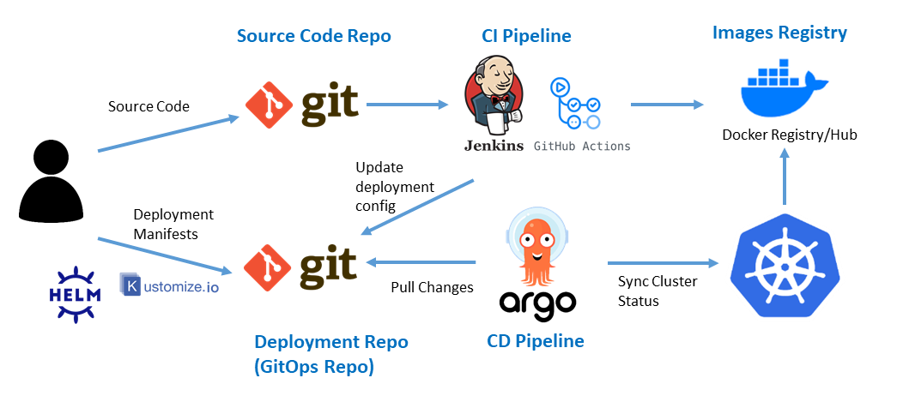

# Building a CD Pipeline with GitOps and ArgoCD 🛠️

## Project Objective 🚀

This project aims to establish a CD pipeline using a public repository and a Docker image.

## What is a CI/CD pipeline? 🔄

A **CI/CD** (_Continuous Integration/Continuous Deployment_) pipeline automates software delivery processes, ensuring frequent code integrations, tests, and deployment. It starts with Continuous Integration, merging code changes regularly, followed by Continuous Deployment, automating the release to production, enabling faster, more reliable software delivery.

<div style="text-align:center;">
  
</div>

## Why do we need to decouple CD pipeline from CI pipeline? 🤔

Decoupling **CD** from **CI** enhances flexibility in software release cycles. It allows independent scaling, optimizations, and customization of deployment processes. This separation prevents bottlenecks, enabling tailored strategies for testing, deployment, and release, fostering more efficient and adaptable development workflows.

## What is GitOps? 

GitOps is a DevOps methodology where the entire system state is declared and managed in a Git repository. Automation tools use **Git as the single source of truth** to continuously deploy and update infrastructure and applications.

<div style="text-align:center;">
  
</div>

## What is ArgoCD ❓

ArgoCD is an open-source Continuous Delivery tool used for deploying and managing applications in Kubernetes clusters. It utilizes a GitOps approach, syncing desired application state defined in Git repositories with the actual state in the cluster, ensuring consistency and enabling automated deployments and updates.

<div style="text-align:center;">
  
</div>

## Advantages of using GitOps with ArgoCD 🌟

1. **Enhanced Collaboration:** Facilitates team collaboration by using Git as a single source of truth, enabling code reviews, versioning, and collaboration among team members. 👥
2. **Auditability and Rollbacks:** Offers a transparent audit trail of changes, allowing easy rollbacks to previous known working states by reverting changes in the Git repository. 🔍
3. **Scalability and Efficiency:** Scales well for complex applications, enabling efficient management of multiple environments and configurations with minimal human intervention. 🚀

## How does ArgoCD Work? 🤔

Lets understand it through a diagram.

<div style="text-align:center;">
  
</div>

Now a step-by-step breakdown of how ArgoCD works from code commit to deployment on k8s:

- Developer send source code to Source Code Repo,then CI pipeline tool update deployment configuration in GItOps Repo.
- Devops team can also commit Deployment Manifests to GitOps Repo.
- ArgoCD is configured to watch a specific Git repository and branch where the code changes are stored.
- ArgoCD continuously monitors the designated Git repository for changes **Through a Pull Based Model.**
- When developers push changes, ArgoCD detects the modifications in the Git repository.
- ArgoCD compares the code changes in the Git repository (desired state) with the current state of applications in the Kubernetes cluster.
- If there are disparities between the desired and current states, ArgoCD initiates a synchronization process.
- ArgoCD automates the deployment process based on the code changes, updating the Kubernetes cluster to match the desired state.
- After deployment, ArgoCD verifies that the changes meet specified criteria. In the event of issues, ArgoCD seamlessly performs automated rollbacks, reverting to the previous known stable state for a reliable and consistent application environment.
- ArgoCD continues to monitor the Git repository for new changes, repeating the process to maintain a continuous deployment cycle.

## Instillation of ArgoCD in K8S Cluster 🛠️

**Prerequisites:**

- Any k8s cluster
- Docker Engine
- Kubectl
- Helm
- Github Account
- Dockerhub Account

**Install ArgoCD:**

```bash
kubectl create namespace argocd
helm repo add argo https://argoproj.github.io/argo-helm
helm repo update
helm install argocd argo/argo-cd --namespace argocd
```

**Access ArgoCD UI In Port 8080:**

```bash
kubectl port-forward svc/argocd-server -n argocd 8080:443
```

**The Login UI will look like below the image:** We have to provide Username and Password.

<div style="text-align:center;">
  
</div>

The initial `Username` is **admin**

To get the `password` run this command:

```bash
kubectl get secret argocd-initial-admin-secret -n argocd -o jsonpath="{.data.password}" | base64 --decode
```


To establish a continuous delivery (CD) pipeline, let's start by creating a public GitHub repository named **"argocd-public."** Clone this repository to your local machine.

For simulating a CD pipeline, we require a Docker image. We'll leverage the nginx Docker image and transform it into our custom Docker image named **"mynginx."**

To build this image, execute the following commands. Make sure to replace **"your_username"** with your actual dockerhub username.

```bash
docker login
docker pull nginx:1.25.3
docker tag nginx:1.25.3 your_username/mynginx:v0.1.0
docker push your_username/mynginx:v0.1.0
```

## Set Up for CD Pipeline 🛠️

Navigate to the **argocd-public** directory and create directories named **"argocd-application-files"** and **"k8s-resources."**

Inside the **"k8s-resources"** directory, create a directory named **"my-app."** Now, let's create Kubernetes resource files, namely **namespace.yaml** and **deployment.yaml,** inside the **my-app** directory.

### Code for Kubernetes Resources

> Execute the following commands in the **argocd-public** directory.

```bash
mkdir k8s-resources
cd k8s-resources

mkdir my-app
cd my-app
touch namespace.yaml deployment.yaml
```

In order to create namespace called **foo** add this code to **namespace.yaml.**

```yaml
---
apiVersion: v1
kind: Namespace
metadata:
  name: foo
```

the same way add the following code to **deployment.yaml** to create deployment.

```yaml
---
apiVersion: apps/v1
kind: Deployment
metadata:
  name: nginx
  namespace: foo
  labels:
    app: nginx
spec:
  replicas: 1
  selector:
    matchLabels:
      app: nginx
  template:
    metadata:
      labels:
        app: nginx
    spec:
      containers:
        - name: nginx
          image: panchanandevops/mynginx:v0.1.0
          ports:
            - containerPort: 80
```

This Kubernetes YAML defines a Deployment named **"nginx"** in the namespace **"foo"** creating one replica of the **"nginx"** application. It specifies a container using the image **"panchanandevops/mynginx:v0.1.0"** exposing **port 80.**

## ArgoCD Application Files

> For this task, execute the following commands in the **argocd-public** directory.

```bash
mkdir argocd-application-files
cd argocd-application-files
touch application.yaml
```

Now add this yml code inside application.yaml file

```yaml
---
apiVersion: argoproj.io/v1alpha1
kind: Application
metadata:
  name: my-app
  namespace: argocd
  finalizers:
    - resources-finalizer.argocd.argoproj.io
spec:
  project: default
  source:
    repoURL: https://github.com/panchanandevops/argocd-public.git
    targetRevision: HEAD
    path: k8s-resources/my-app
  destination:
    server: https://kubernetes.default.svc
  syncPolicy:
    automated:
      prune: true
      selfHeal: true
      allowEmpty: false
    syncOptions:
      - Validate=true
      - CreateNamespace=false
      - PrunePropagationPolicy=foreground
      - PruneLast=true
```

Then push these resources on github repo.

## Understanding CRD of ArgoCD 🧐

Lets break down the application.yml file, and understand how argocd working behind!

```yaml
apiVersion: argoproj.io/v1alpha1
kind: Application
```

Here we are defining apiVersion and kind according to argocd CRD.

```yaml
metadata:
  name: my-app
  namespace: argocd
  finalizers:
    - resources-finalizer.argocd.argoproj.io
```

This YAML defines metadata for a Kubernetes resource named "my-app" in the "argocd" namespace, including a finalizer to be executed when deleting the resource.

```yaml
project: default
  source:
    repoURL: https://github.com/panchanandevops/argocd-public.git
    targetRevision: HEAD
    path: k8s-resources/my-app
  destination:
    server: https://kubernetes.default.svc
```

This Argo CD project configuration specifies a project named "default" with a Git repository as the source **(`https://github.com/panchanandevops/argocd-public.git`)**. The target revision is set to `HEAD`, and the Kubernetes manifest files are located at the path **"k8s-resources/my-app."** The destination is a Kubernetes cluster specified by the server URL **`https://kubernetes.default.svc`**.

```yaml
syncPolicy:
  automated:
    prune: true
    selfHeal: true
    allowEmpty: false
```

The syncPolicy section of this Argo CD project configuration enables automated synchronization with the specified Git repository, allowing pruning of resources, self-healing, and disallowing synchronization of empty manifests.

```yaml
syncOptions:
  - Validate=true
  - CreateNamespace=false
  - PrunePropagationPolicy=foreground
  - PruneLast=true
```

The syncOptions section in this Argo CD project configuration provides specific synchronization options, including validation, avoiding the creation of namespaces, specifying pruning propagation policy as "foreground," and enabling the pruning of the last resource during synchronization.


now we understood how argocd works, lets apply application.yaml in local k8s cluster. This this only time we will apply kubectl apply command manually.

```bash
kubectl apply -f argocd-public
/argocd-application-files/application.yaml
```

You can verify you k8s resources by apply these commands

```bash
 kubectl get namespaces
 kubectl get deployments -n foo
```

For subsequent releases, update the image section of the deployment to the second version of the image. Push the changes to your GitHub repository. After approximately 3 minutes, ArgoCD will automatically deploy the updated deployment with the second version of the **mynginx** image.

# Conclusion 🚀

In this project, we've crafted a GitOps-driven Continuous Delivery (CD) pipeline using ArgoCD 🛠️. Leveraging a public GitHub repository, Docker images, and Kubernetes manifests, we demonstrated seamless synchronization of Kubernetes resources 📦. As you explore this GitOps approach, remember to adapt configurations and continuously enhance your CD practices 🌟. Happy deploying! 💻🔥

## Acknowledgment 🙏

Special thanks to **Anton Putra** for sharing valuable insights and knowledge. You can find Anton on [Anton Putra Youtube Channel](https://www.youtube.com/@AntonPutra) where he provides educational content and tutorials.


